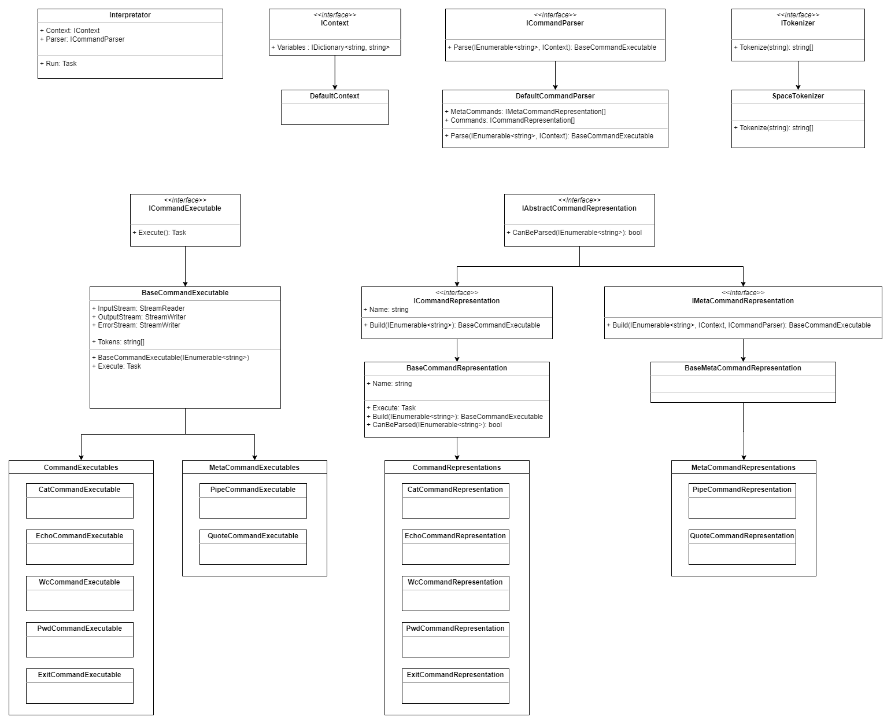

# CSharpBashInterpreter
Базовый интерпретатор командной строки, написанный на языке C#.

Работа выполнена студентами **MSE ИТМО**:
- Сикачин Николай
- Егорычев Андрей
- Воробьев Алексей

# Структура программы

Основная логика цикла обработки команд и взаимодействия с пользователем определена в классе ``Interpretator``. Он использует интерфейс c основной логикой парсинга ``ICommandParser`` для получения из строчки команды и впоследствии её исполнения, а так же обработки ошибок и пользовательского ввода.

### ICommandParser
Парсер производит замену переменных окружения, разбиение строки на токены с помощью ``ITokenizer``.  
После этого происходит матчинг полученных токенов с отсортированным по приоритету массивом мета-команд, после с массивом команд, после запрос к внешним программам.
При возможности парсинга команды (удачном вызове метода CanParse у ``IXXXComandRepresentation``) происходит передача управления парсингом в соответствующую команду.  

### IXXXComandRepresentation
Класс представляющий из себя объект с информацией о команде, её логика парсинга из строки (какие есть аргументы, флаги и т.д.).
Так же ответственный за корректное создание ``ICommandExceutable`` в зависимости от предоставленных пользователем аргументов.

- Обычные команды реализуют пользовательские и системные команды на подобии cat, ls, wc и внешние запускаемые из системы.
- Мета-команды формируют абстрактное синтаксическое дерево запроса, к таким командам относятся Pipe, Semicolon, If-Then-Else, etc. В листьях АСД находятся команды или запросы к внешним программам.  

### ICommandExceutable

Класс описывающее runtime команды, исполняющий саму логику программы. Может реализовать как написанный код на C#, так и вызывать внешнуюю системную команду.
Каждая команда имеет 3 потока ввода-вывода, InputStream, OutputStream и ErrorStream. По умолчанию они заданны как соответствующие потоки консоли, но это поведение может быть перопределено мета-командами для перенаправления потоков в другие команды, файлы и т.д.  

## Фазы
В рамках 1 фазы планируется реализация основной иерархии классов, механику парсинга и разбиения строки в соответствии с архитектурой и реализации всех "обычных" команд. 
В рамках 2 фазы планируется реализовать мета-команды, логику их обработки строки и непосредственно подстановку переменных окружения и логику pipe-ов.

## Схема классов:

